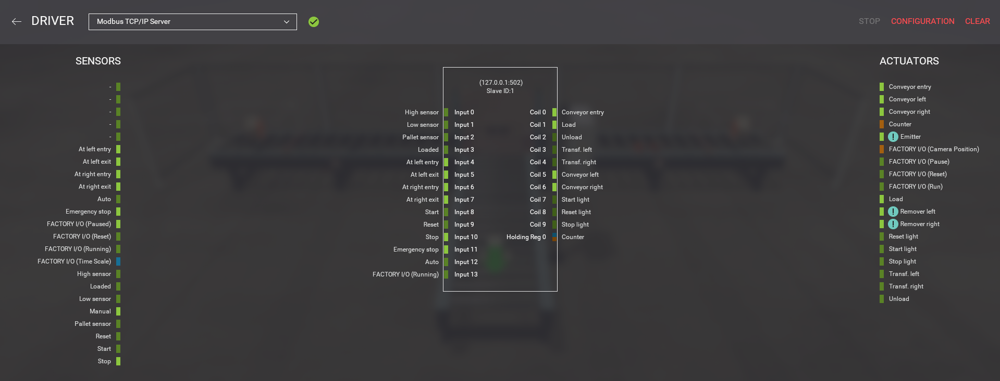

# Height-Based Box Sorting System

A PLC-controlled sorting system that automatically separates boxes by height onto two lanes. The control logic is written in **OpenPLC** using Ladder Logic (IEC 61131-3), and the physical machinery is simulated in **Factory I/O**, with the two connected over **Modbus TCP**.

---

## Demo

[▶ Watch the demo video](https://drive.google.com/file/d/1kCXuybAtfKXwHFnfI3lJmANSGafFeYZG/view?usp=sharing)

A short video showing the system sorting tall and short boxes in real time.

---

## What it does

Boxes travel on pallets toward a chain-transfer sorting station. As each box passes a set of height sensors, the controller determines whether it is tall or short and fires the chain transfer to push it onto the correct lane:

- **Tall boxes are sorted to the right**
- **Short boxes are sorted to the left**

The system runs the full cycle automatically — feeding boxes in, measuring them, making the sorting decision, diverting them, and bringing in the next box. A significant part of the design went into reliable sequencing so that boxes don't jam or collide at the sorting point.

---

## System architecture

```
   OpenPLC (control logic)  <-- Modbus TCP -->  Factory I/O (3D simulation)
```

- **OpenPLC** runs the ladder logic that makes all the control decisions.
- **Factory I/O** simulates the conveyors, chain transfer, sensors, and boxes.
- **Modbus TCP** links the two, letting the controller read the sensors and drive the actuators.

The simulation uses the "Sorting by Height" scene in Factory I/O.



---

## Inputs and outputs

**Sensors (inputs read by the PLC):**

| Name             | Address | Purpose                                                          |
|------------------|---------|------------------------------------------------------------------|
| `HighSensor`     | %IX0.0  | Tripped only by tall boxes                                       |
| `LowSensor`      | %IX0.1  | Detects box presence; combined with the high sensor to identify short boxes |
| `PalletSensor`   | %IX0.2  | Detects an incoming pallet to begin the sequence                 |
| `Loaded`         | %IX0.3  | Confirms the box is in position on the chain transfer            |
| `LeftEntry`      | %IX0.4  | Detects a box arriving on the left lane                          |
| `at_right_entry` | %IX0.6  | Detects a box arriving on the right lane                         |

**Actuators (outputs driven by the PLC):**

| Name            | Address | Function                                       |
|-----------------|---------|------------------------------------------------|
| `conveyor`      | %QX0.0  | Entry conveyor feeding boxes toward the sorter |
| `Load`          | %QX0.1  | Moves the box onto the chain transfer          |
| `TransferLeft`  | %QX0.3  | Pushes a box to the left lane                  |
| `TransferRight` | %QX0.4  | Pushes a box to the right lane                 |
| `ConveyorLeft`  | %QX0.5  | Left lane conveyor                             |
| `conveyorRight` | %QX0.6  | Right lane conveyor                            |

**Internal memory bits:** `highsensor_memorybit` and `lowsensor_memorybit` are used to retain the height decision (explained below).


---

## How the control logic works

The program is organized into separate rungs, each handling one stage of the process:

**Startup.** On start, the entry conveyor and both lane conveyors are switched on so the system is running and ready.

**Feed control.** When a pallet reaches the sorting point, the entry conveyor stops so the next box doesn't collide with the one being sorted. It restarts once the current box has cleared the chain transfer.

**Loading.** When a pallet is detected, the `Load` conveyor runs to move the box onto the chain transfer, then stops once the box is confirmed in position.

**Height detection.** As a box passes the sensors:
- A tall box trips the high sensor, which is captured as "tall."
- A short box trips the low sensor while the high sensor stays off, which is captured as "short."

**Sorting.** Once the box is fully loaded, a tall box is pushed right and a short box is pushed left.

**Reset.** When the box reaches its lane, the transfer switches off and the height memory clears, leaving the system ready for the next box.

### Ladder logic


---

## Key design decisions

A few problems required deliberate solutions, and these are the parts of the design I'm most satisfied with:

**Retaining the height decision after the sensor loses the box.**
The height sensors only see a box briefly as it passes. By the time the box is in position to be sorted, the sensors no longer detect it, so the controller can't react to them directly at that point. The solution was to capture the box's height into a memory bit the moment it's detected and hold that state until the box is sorted. This is what allows the correct decision to be applied later in the cycle.

**Distinguishing short boxes from empty pallets.**
A short box is identified as the low sensor being active while the high sensor is not — rather than simply assuming "not tall means short." Requiring confirmation that a box is actually present prevents an empty pallet from being sorted by mistake, keeping the logic consistent for a real-life use case.

**Eliminating jamming with latched transfers.**
Driving the transfer directly from a sensor caused boxes to jam, because the transfer stopped the moment the box moved off the sensor. The fix was to latch the transfer on when the sorting decision is made and switch it off only once the box has confirmed arrival on the lane, so the push always completes.

**Acting once per box with edge detection.**
A normal contact stays active the whole time a sensor sees a box, which can cause an action to repeat over and over while the box sits in front of the sensor. To avoid this, I used edge triggers (R_TRIG / F_TRIG), which respond only at the moment a sensor switches on or off rather than the whole time it's active. This makes each action happen exactly once per box.

---

## Tools and concepts

- **OpenPLC** — open-source PLC editor and runtime (Ladder Logic, IEC 61131-3)
- **Factory I/O** — 3D industrial simulation
- **Modbus TCP** — communication protocol between controller and simulation
- Ladder Logic concepts applied: Set/Reset coils, normally-open and normally-closed contacts, rising/falling edge triggers (R_TRIG / F_TRIG), internal memory bits, and sequential interlocking

---

## Project files

- `SortByHightPlc.xml` — the OpenPLC ladder logic program

**To run it:**
1. Import `SortByHightPlc.xml` into OpenPLC Editor.
2. In Factory I/O, load the built-in **"Sorting by Height (Basic)"** scene.
3. Set the Factory I/O driver to **Modbus TCP/IP Server**.
4. Connect OpenPLC to the runtime, upload the program, and start it. The system will begin sorting automatically.

---

## Author

**Ebrahim Aljabban** — Mechatronics Engineering
